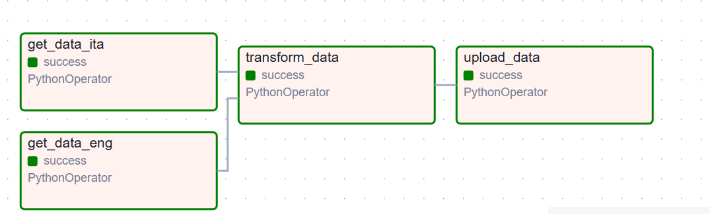

# Airflow - S3 AI News Collector

This project creates an **Apache Airflow workflow** to collect news data about **AI** from English and Italian media sources, and stores the collected data in an **S3 bucket**.

The news data is gathered using the [News API](https://newsapi.org/).

S3 access is managed using an **IAM user** with the **S3 full access policy**.

---

## **Prerequisites**

Before running the workflow, you need to:

1. Install the required dependencies listed in the `requirements.txt` file:
2. Modify the `dags_folder` parameter in your `airflow.cfg` file to include the path `./Airflow_AWS_project/dags` for Airflow to function correctl
3. In the `tasks/dag_tasks.py` file, insert your **News API key** to connect to the API. 
4. In the same `tasks/dag_tasks.py` file, input your **IAM user credentials** (Access Key and Secret Key) and the S3 bucket name for accessing your S3 bucket.